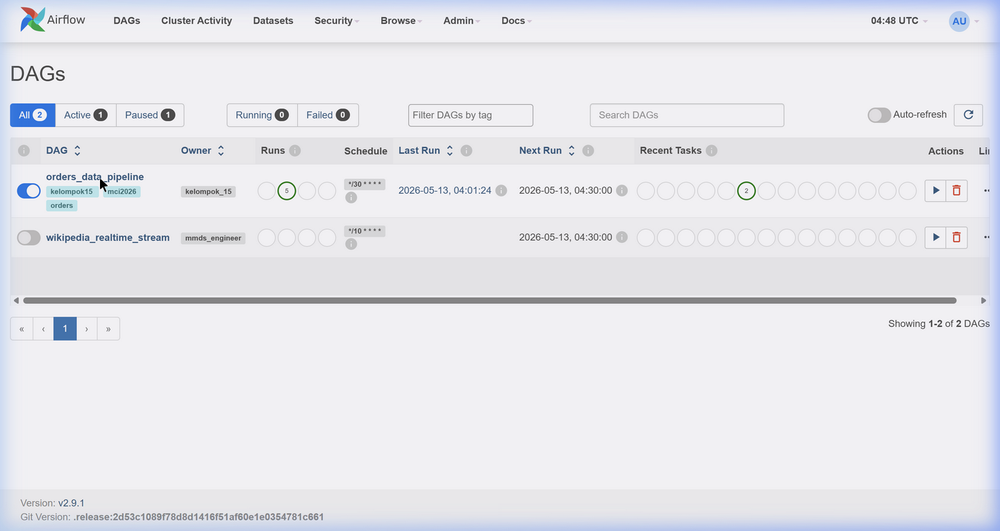
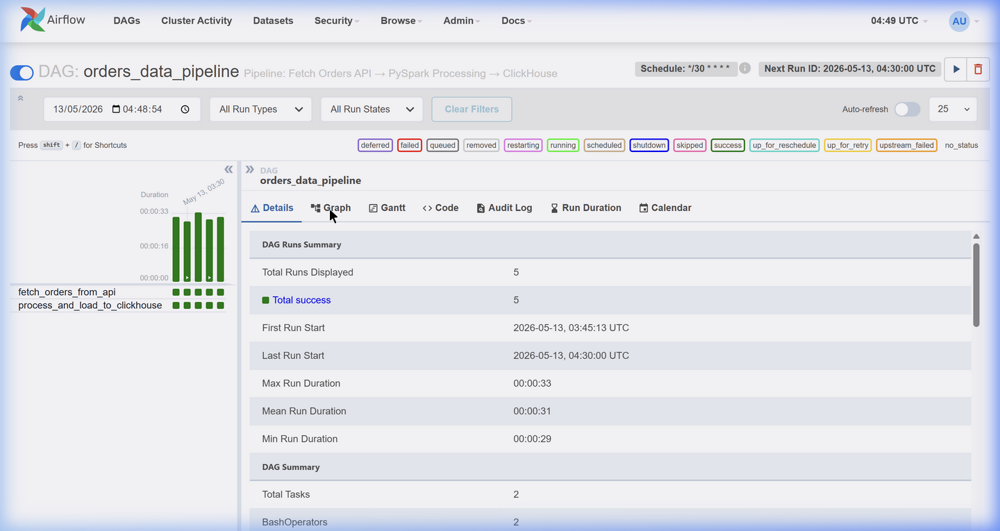
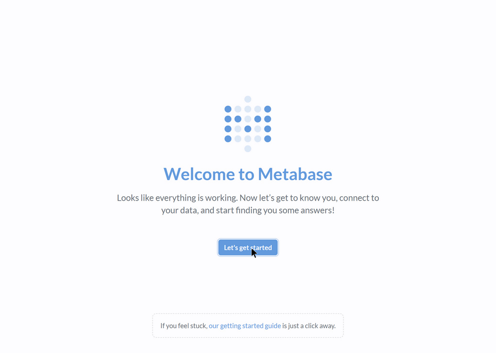
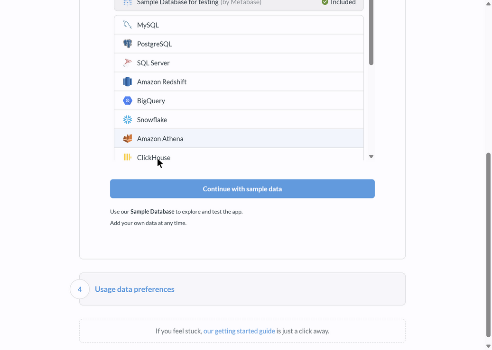
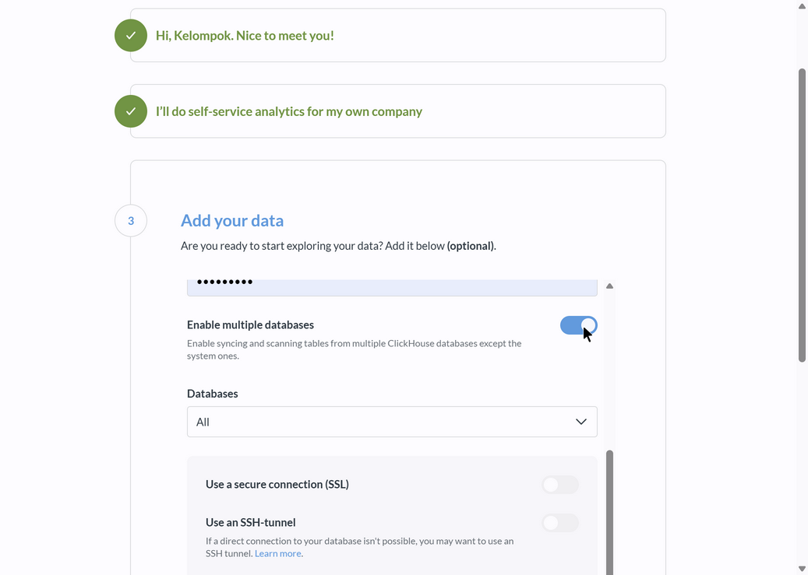
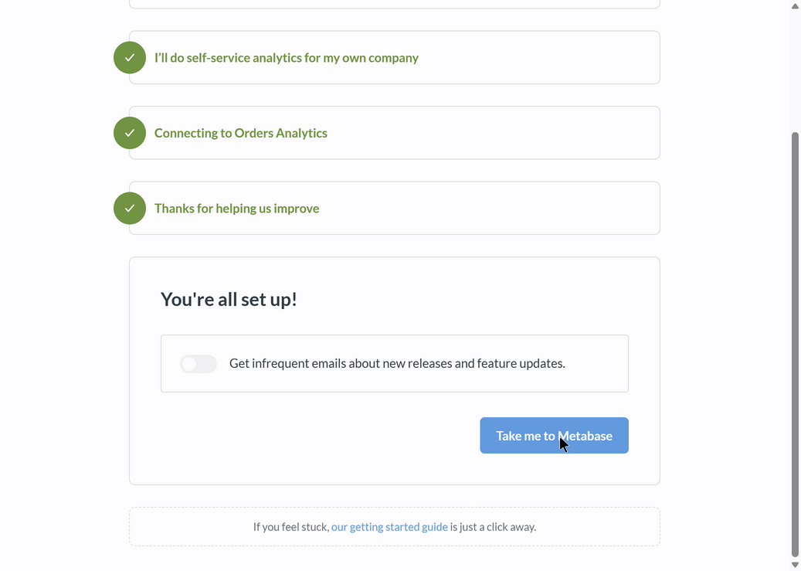
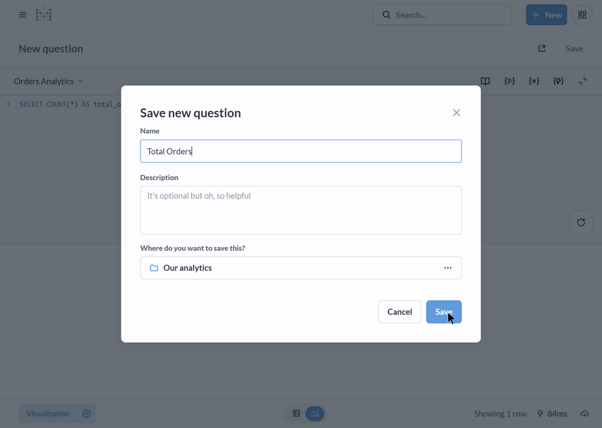

# 🛒 Orders Data Pipeline — MCI 2026 Task 2 Kelompok 15

> **End-to-End Data Pipeline**: REST API → Apache Airflow → PySpark → ClickHouse → Metabase

Proyek ini membangun pipeline data **otomatis** yang mengambil data pesanan (orders) dari REST API, memprosesnya dengan Apache Spark, menyimpannya ke ClickHouse sebagai data warehouse, dan memvisualisasikannya melalui Metabase dashboard — seluruhnya diorkestrasi oleh Apache Airflow dan dikemas dalam Docker.

---

## 🏗️ Arsitektur Sistem

```
REST API (Orders)
     ↓  (100 orders per batch)
[Ingestion — Python requests]
     ↓  simpan .parquet
[Data Lake — folder lokal]
     ↓  baca & agregasi
[Processing — Apache Spark]
     ↓  truncate-insert
[Data Warehouse — ClickHouse]
     ↓  koneksi langsung
[Dashboard — Metabase]

↻  Seluruh siklus diorkestrasi oleh Apache Airflow (setiap 30 menit)
```

**Dataset**: `http://96.9.212.102:8000/orders`

---

## 🛠️ Tech Stack

| Komponen | Teknologi |
|----------|-----------|
| Orchestration | Apache Airflow 2.9 |
| Processing | Apache Spark / PySpark 3.5 |
| Data Warehouse | ClickHouse (column-oriented OLAP) |
| BI & Dashboard | Metabase |
| Infrastructure | Docker & Docker Compose |
| Language | Python 3.11 |

---

## 📂 Struktur Proyek

```
wikipedia-realtime-pipeline/
├── dags/
│   ├── orders_pipeline.py                  # ✨ DAG Airflow untuk Orders Pipeline
│   └── scripts/
│       ├── fetch_orders.py                 # ✨ Fetch API → Data Lake (.parquet)
│       ├── process_orders.py               # ✨ PySpark: agregasi & load ke ClickHouse
│       ├── fetch_wikipedia_stream.py       # (Modul sebelumnya)
│       ├── process_wikipedia_spark.py      # (Modul sebelumnya)
│       └── wikipedia_pipeline.py           # (Modul sebelumnya)
├── data_lake/                              # Penyimpanan sementara .parquet
├── sql/
│   ├── clickhouse_ddl.sql                  # ✨ DDL pembuatan tabel ClickHouse
│   └── metabase_queries.sql                # ✨ 30 query untuk Metabase Questions
├── screenshots/                            # Screenshot dokumentasi
├── docker-compose.yml                      # Konfigurasi seluruh service
├── Dockerfile                              # Custom Airflow image
├── requirements.txt                        # Dependensi Python
└── README.md                               # Dokumentasi ini
```

---

## 📊 Tentang Dataset

API `http://96.9.212.102:8000/orders` mengembalikan **100 orders acak** setiap kali dipanggil, dengan struktur **nested JSON**:

```json
{
  "total_orders": 100,
  "orders": [
    {
      "order_id": 25377,
      "user_id": 69667,
      "order_number": 14,
      "order_dow": 0,
      "order_hour_of_day": 20,
      "days_since_prior_order": 2.0,
      "eval_set": "prior",
      "products": [
        {
          "product_id": 40945,
          "product_name": "Baking Chopped Pecans",
          "aisle_id": 17,
          "aisle": "baking ingredients",
          "department_id": 13,
          "department": "pantry",
          "add_to_cart_order": 1,
          "reordered": 0
        }
      ]
    }
  ]
}
```

Pipeline mem-**flatten** data nested ini menjadi **2 tabel raw** + **5 tabel agregasi** di ClickHouse.

---

# 🚀 Tutorial Step-by-Step

## Step 1 — Prasyarat

Pastikan sudah terinstal:
- ✅ [Docker Desktop](https://docs.docker.com/get-docker/) — sudah berjalan
- ✅ Git — untuk clone repository
- ✅ Terminal (Git Bash / PowerShell / CMD)

---

## Step 2 — Clone Repository

```bash
git clone <URL_REPO>
cd wikipedia-realtime-pipeline
```

---

## Step 3 — Build Docker Image

Perintah ini akan membuild semua image yang diperlukan (Airflow + dependensi Python + Java JRE untuk Spark):

```bash
docker-compose build
```

> ⏱️ Proses ini memakan waktu 3–5 menit tergantung koneksi internet (mengunduh ~300MB PySpark).

---

## Step 4 — Inisialisasi Database Airflow

Perintah ini membuat database internal Airflow dan user admin:

```bash
docker-compose up airflow-init
```

Tunggu hingga muncul pesan:
```
airflow-init-1  | User "admin" created with role "Admin"
airflow-init-1 exited with code 0
```

---

## Step 5 — Jalankan Seluruh Service

```bash
docker-compose up -d
```

Perintah ini menjalankan **5 container** secara bersamaan:

| Container | Fungsi | Port |
|-----------|--------|------|
| `postgres` | Database internal Airflow | - |
| `airflow-webserver` | UI Airflow | **8080** |
| `airflow-scheduler` | Penjadwal DAG | - |
| `clickhouse-server` | Data Warehouse | **8123**, 9000 |
| `metabase` | BI Dashboard | **3000** |

Tunggu **1–2 menit** agar semua service siap.

---

## Step 6 — Aktifkan & Jalankan DAG di Airflow

### 6.1 Buka Airflow

Buka browser: **http://localhost:8080**

Login dengan:
- **Username**: `admin`
- **Password**: `admin`

### 6.2 Temukan DAG

Pada halaman DAGs, cari DAG bernama **`orders_data_pipeline`**. Terlihat juga DAG `wikipedia_realtime_stream` dari modul sebelumnya.



### 6.3 Aktifkan DAG

Geser **toggle switch** di sebelah kiri nama DAG untuk mengaktifkannya (dari abu-abu menjadi biru).

### 6.4 Trigger DAG Manual

Klik tombol **▶️ (Play)** di kolom Actions untuk menjalankan DAG sekarang.

### 6.5 Tunggu & Verifikasi

Klik nama DAG **`orders_data_pipeline`** untuk masuk ke halaman detail. Anda akan melihat:



**Yang diperhatikan:**
- **DAG Runs Summary**: `Total success = 5` (atau sesuai jumlah run)
- **Grid View**: Semua kotak berwarna **hijau** (= success)
- **Mean Run Duration**: Rata-rata ~31 detik per siklus
- **Total Tasks**: 2 (fetch + process)

### 6.6 Alur di Balik Layar

Setiap kali DAG berjalan, ini yang terjadi:

```
[Trigger DAG]
     ↓
[Task 1: fetch_orders_from_api]
  → Hit API http://96.9.212.102:8000/orders
  → Terima 100 orders (nested JSON)
  → Flatten menjadi 2 DataFrames (orders + products)
  → Simpan sebagai .parquet di data_lake/orders/
     ↓
[Task 2: process_and_load_to_clickhouse]
  → Baca .parquet dengan PySpark
  → Hitung 5 agregasi (top products, departments, hourly, dll)
  → Load 7 tabel ke ClickHouse (TRUNCATE + INSERT)
  → Hapus .parquet lama (cleanup)
     ↓
[Selesai ✅ → menunggu 30 menit → ulangi]
```

---

## Step 7 — Validasi Data di ClickHouse

### 7.1 Masuk ke ClickHouse Client

```bash
docker exec -it wikipedia-realtime-pipeline-clickhouse-server-1 \
  clickhouse-client --user admin --password rahasia
```

### 7.2 Cek Database & Tabel

```sql
SHOW DATABASES;
```

Output:
```
INFORMATION_SCHEMA
default
information_schema
orders_analytics    ← database kita
system
```

```sql
USE orders_analytics;
SHOW TABLES;
```

Output:
```
aisle_stats
department_stats
dow_distribution
hourly_distribution
order_products
orders
top_products
```

### 7.3 Hitung Data

```sql
SELECT COUNT(*) FROM orders_analytics.orders;
-- Hasil: 100

SELECT COUNT(*) FROM orders_analytics.order_products;
-- Hasil: ~1000 (bervariasi)
```

### 7.4 Lihat Top Products

```sql
SELECT product_name, order_count, reorder_rate
FROM orders_analytics.top_products
ORDER BY order_count DESC
LIMIT 10;
```

Output contoh:
```
┌─product_name─────────────┬─order_count─┬─reorder_rate─┐
│ Banana                   │          17 │        94.12 │
│ Bag of Organic Bananas   │          16 │        93.75 │
│ Organic Baby Spinach     │          11 │        63.64 │
│ Organic Avocado          │           8 │           75 │
│ Limes                    │           7 │        57.14 │
│ Organic Garlic           │           7 │        85.71 │
│ Organic Hass Avocado     │           6 │        66.67 │
│ Organic Strawberries     │           5 │           80 │
│ Large Lemon              │           5 │          100 │
│ Strawberries             │           5 │           60 │
└──────────────────────────┴─────────────┴──────────────┘
```

### 7.5 Lihat Statistik per Department

```sql
SELECT department, total_products_ordered, reorder_rate
FROM orders_analytics.department_stats
ORDER BY total_products_ordered DESC;
```

### 7.6 Lihat Distribusi Order per Jam

```sql
SELECT * FROM orders_analytics.hourly_distribution
ORDER BY order_hour_of_day;
```

### 7.7 Keluar dari ClickHouse

```sql
exit
```

---

## Step 8 — Setup Metabase

### 8.1 Buka Metabase

Buka browser: **http://localhost:3000**

> ⏱️ Pertama kali Metabase butuh ~30 detik untuk booting.

### 8.2 Halaman Welcome

Anda akan melihat halaman **"Welcome to Metabase"**. Klik **"Let's get started"**.



### 8.3 Isi Data Diri

Pada halaman **"What should we call you?"**, isi form:

| Field | Value |
|-------|-------|
| First name | `Kelompok` |
| Last name | `15` |
| Email | `kelompok15@mci.ac.id` |
| Company or team name | `MCI 2026` |
| Password | `Admin123!` |
| Confirm password | `Admin123!` |

Klik **Next**.

### 8.4 Pilih Jenis Penggunaan

Pilih **"I'll do self-service analytics for my own company"**, lalu klik **Next**.

---

## Step 9 — Koneksikan Metabase ke ClickHouse

### 9.1 Halaman "Add your data"

Pada step 3 setup wizard, Anda akan melihat pilihan database. Scroll ke bawah dan pilih **ClickHouse**.



### 9.2 Isi Form Koneksi ClickHouse



Isi field berikut:

| Field | Value |
|-------|-------|
| Display name | `Orders Analytics` |
| Host | `clickhouse-server` |
| Port | `8123` |
| Database name | `orders_analytics` |
| Username | `admin` |
| Password | `rahasia` |

> ⚠️ **Penting**: Host bukan `localhost`, tapi `clickhouse-server` karena Metabase mengakses ClickHouse melalui jaringan Docker internal.

> ⚠️ **SSL & SSH**: Biarkan **OFF** (tidak dicentang).

Klik **Connect database**.

### 9.3 Selesaikan Setup

Pada step 4 (Usage data preferences), klik **Finish**.

Anda akan melihat halaman konfirmasi:



Klik **"Take me to Metabase"** untuk masuk ke halaman utama.

---

## Step 10 — Membuat Questions di Metabase

### 10.1 Cara Membuat Question

1. Klik **"+ New"** di pojok kanan atas
2. Pilih **"SQL query"**
3. Pastikan database **"Orders Analytics"** terpilih (klik dropdown di kiri atas jika perlu)
4. Ketik atau paste query SQL di editor
5. Klik tombol biru **▶ (Run)** atau tekan `Ctrl+Enter`
6. Setelah hasil muncul, klik **"Visualization"** di pojok kiri bawah untuk mengubah tipe chart
7. Klik **"Save"** → beri nama → klik **Save**



> ⚠️ **Catatan penting**: Kolom `reorder_rate` di tabel `top_products` dan `department_stats` sudah dalam skala **0–100** (bukan 0–1). Jangan dikali 100 lagi saat ditampilkan.

---

### 10.2 Daftar Questions yang Dibuat

#### 📌 Tab 1: Overview — KPI Cards (Number)

| No | Nama Question | Query | Visualisasi |
|----|--------------|-------|-------------|
| Q1 | **Total Orders** | `SELECT COUNT(*) AS total_orders FROM orders_analytics.orders` | Number |
| Q2 | **Total Products** | `SELECT COUNT(DISTINCT product_name) AS total_products FROM orders_analytics.order_products` | Number |
| Q3 | **Unique Users** | `SELECT COUNT(DISTINCT user_id) AS total_users FROM orders_analytics.orders` | Number |
| Q4 | **Avg Basket Size** | `SELECT ROUND(AVG(product_count), 2) AS avg_basket FROM orders_analytics.orders` | Number |
| Q5 | **Reorder Rate** | `SELECT ROUND(AVG(reorder_rate), 2) AS avg_reorder_rate FROM orders_analytics.top_products` | Number |

#### 📊 Tab 1: Overview — Bar & Donut Charts

| No | Nama Question | Query | Visualisasi |
|----|--------------|-------|-------------|
| Q6 | **Top 10 Department** | `SELECT department, total_products_ordered FROM orders_analytics.department_stats ORDER BY total_products_ordered DESC LIMIT 10` | Row (horizontal bar) — Y: department, X: total_products_ordered |
| Q8 | **Top 10 Produk Terlaris** | `SELECT product_name AS produk, order_count AS total_pesanan FROM orders_analytics.top_products ORDER BY order_count DESC LIMIT 10` | Row (horizontal bar) — Y: produk, X: total_pesanan |

Query Q7 — **Top 5 Department + Others**:
```sql
SELECT 
    CASE 
        WHEN row_num <= 5 THEN department
        ELSE 'Others'
    END AS kategori,
    SUM(total_products_ordered) AS total
FROM (
    SELECT 
        department,
        total_products_ordered,
        ROW_NUMBER() OVER (ORDER BY total_products_ordered DESC) AS row_num
    FROM orders_analytics.department_stats
) t
GROUP BY kategori
ORDER BY total DESC
```
Visualisasi: **Pie** → Donut

---

#### 📊 Tab 2: Loyalty & Performance — Bar Charts

| No | Nama Question | Query | Visualisasi |
|----|--------------|-------|-------------|
| Q9 | **Dept Ranking by Reorder Rate** | `SELECT department, ROUND(reorder_rate, 2) AS reorder_persen FROM orders_analytics.department_stats ORDER BY reorder_rate DESC` | Row (horizontal bar) — warna orange |
| Q10 | **Top 20 Product Highest Reorder** | `SELECT product_name AS produk, ROUND(reorder_rate, 2) AS reorder_persen FROM orders_analytics.top_products ORDER BY reorder_rate DESC LIMIT 20` | Row (horizontal bar) — warna orange |
| Q11 | **Bottom 10 Products** | `SELECT product_name AS produk, order_count AS total_pesanan FROM orders_analytics.top_products ORDER BY order_count ASC LIMIT 10` | Row (horizontal bar) — warna merah |

#### 📈 Tab 2: Loyalty & Performance — Combo & Scatter

Query Q12 — **Products: Order Count vs Reorder Rate**:
```sql
SELECT 
    product_name AS produk,
    order_count AS total_pesanan,
    ROUND(reorder_rate, 2) AS reorder_persen
FROM orders_analytics.top_products 
LIMIT 30
```
Visualisasi: **Scatter** — X: total_pesanan, Y: reorder_persen

Query Q13 — **Dept Total vs Reorder Rate**:
```sql
SELECT 
    department,
    total_products_ordered AS total_produk,
    ROUND(reorder_rate, 2) AS reorder_persen
FROM orders_analytics.department_stats 
ORDER BY total_products_ordered DESC
LIMIT 10
```
Visualisasi: **Combo** — Bar: total_produk, Line: reorder_persen

#### 📋 Tab 2: Loyalty & Performance — Table & Donut

Query Q14 — **Complete Product Leaderboard**:
```sql
SELECT 
    ROW_NUMBER() OVER (ORDER BY order_count DESC) AS ranking,
    product_name AS produk,
    order_count AS total_pesanan,
    ROUND(reorder_rate, 2) AS reorder_persen,
    CASE 
        WHEN reorder_rate > 70 THEN 'Excellent'
        WHEN reorder_rate > 50 THEN 'Good'
        WHEN reorder_rate > 30 THEN 'Average'
        ELSE 'Low'
    END AS reorder_kategori
FROM orders_analytics.top_products 
ORDER BY order_count DESC
```
Visualisasi: **Table** + Conditional Formatting:
- `Excellent` → hijau
- `Good` → kuning
- `Average` → oranye
- `Low` → merah

Query Q15 — **Customer Loyalty Distribution**:
```sql
SELECT 
    CASE 
        WHEN reorder_rate > 60 THEN 'High Loyalty'
        WHEN reorder_rate > 40 THEN 'Medium Loyalty'
        ELSE 'Low Loyalty'
    END AS loyalty_level,
    COUNT(*) AS jumlah_produk,
    ROUND(AVG(order_count), 2) AS avg_order_count
FROM orders_analytics.top_products
GROUP BY loyalty_level
ORDER BY loyalty_level
```
Visualisasi: **Pie** → Donut

---

#### 📈 Tab 3: WHEN — Order Time Patterns

Query Q16 — **Order by Time Period**:
```sql
SELECT 
    CASE 
        WHEN order_hour_of_day BETWEEN 0 AND 5 THEN 'Late Night (00-05)'
        WHEN order_hour_of_day BETWEEN 6 AND 11 THEN 'Morning (06-11)'
        WHEN order_hour_of_day BETWEEN 12 AND 17 THEN 'Afternoon (12-17)'
        WHEN order_hour_of_day BETWEEN 18 AND 23 THEN 'Evening (18-23)'
    END AS periode,
    SUM(order_count) AS total_order
FROM orders_analytics.hourly_distribution 
GROUP BY periode
ORDER BY total_order DESC
```
Visualisasi: **Pie** → Donut

Query Q17 — **Weekday vs Weekend Proportion**:
```sql
SELECT 
    CASE 
        WHEN order_dow IN (0, 6) THEN 'Weekend'
        ELSE 'Weekday'
    END AS tipe,
    SUM(order_count) AS total_order
FROM orders_analytics.dow_distribution 
GROUP BY tipe
```
Visualisasi: **Pie** → Donut

Query Q18 — **Orders by Day of Week**:
```sql
SELECT 
    CASE order_dow 
        WHEN 0 THEN 'Sunday'
        WHEN 1 THEN 'Monday'
        WHEN 2 THEN 'Tuesday'
        WHEN 3 THEN 'Wednesday'
        WHEN 4 THEN 'Thursday'
        WHEN 5 THEN 'Friday'
        WHEN 6 THEN 'Saturday'
    END AS day,
    order_count AS total_orders,
    order_dow
FROM orders_analytics.dow_distribution 
ORDER BY order_dow
```
Visualisasi: **Bar** — X: day, Y: total_orders

Query Q19 — **Orders by Hour of Day**:
```sql
SELECT 
    order_hour_of_day AS hour,
    order_count AS total_orders
FROM orders_analytics.hourly_distribution 
ORDER BY order_hour_of_day
```
Visualisasi: **Area** — X: hour, Y: total_orders

#### 🌍 Tab 3: WHERE — Product Distribution

Query Q20 — **Top 15 Aisle**:
```sql
SELECT 
    aisle AS aisle_name,
    total_products_ordered AS total_products
FROM orders_analytics.aisle_stats 
ORDER BY total_products_ordered DESC 
LIMIT 15
```
Visualisasi: **Bar** (vertikal) — X: aisle_name, Y: total_products

Query Q21 — **Top 10 Aisles in Top Department**:
```sql
SELECT 
    aisle AS aisle_name,
    total_products_ordered AS total_products
FROM orders_analytics.aisle_stats 
WHERE department = 'produce'
ORDER BY total_products_ordered DESC 
LIMIT 10
```
Visualisasi: **Row** (horizontal bar) — Y: aisle_name, X: total_products

Query Q22 — **Basket Size Distribution**:
```sql
SELECT 
    product_count AS basket_size,
    COUNT(*) AS order_count
FROM orders_analytics.orders 
GROUP BY product_count
ORDER BY product_count
```
Visualisasi: **Bar** (vertikal) — X: basket_size, Y: order_count

Query Q23 — **Peak vs Off-Peak Hours**:
```sql
SELECT 
    CASE 
        WHEN order_hour_of_day IN (10, 11, 14, 15, 16, 17) THEN 'Peak Hours'
        ELSE 'Off-Peak Hours'
    END AS kategori,
    SUM(order_count) AS total_order
FROM orders_analytics.hourly_distribution 
GROUP BY kategori
```
Visualisasi: **Pie** → Donut

---

## Step 11 — Membuat Dashboard di Metabase

### 11.1 Buat Dashboard Baru

1. Klik **"+ New"** → pilih **"Dashboard"**
2. Beri nama: **`Orders Analytics Dashboard - Kelompok 15`**
3. Klik **Create**

---

### 11.2 Buat 3 Tab Dashboard

Di edit mode, klik **"+ Add tab"** untuk membuat tiga tab:
- **Tab 1**: `🛒 Overview`
- **Tab 2**: `🔍 Loyalty & Performance`
- **Tab 3**: `⏰ When & Where`

---

### 11.3 Susun Layout Tab 1 — Overview

**Row 1 — 5 KPI Cards (kecil, berjejer)**

```
┌──────────┬──────────┬──────────┬──────────┬──────────┐
│  Total   │  Total   │  Unique  │   Avg    │ Reorder  │
│  Orders  │ Products │  Users   │  Basket  │   Rate   │
│  (Q1)    │  (Q2)    │  (Q3)    │  (Q4)    │  (Q5)    │
└──────────┴──────────┴──────────┴──────────┴──────────┘
```

**Row 2 — Text Card (full width)**

Klik ikon **T (Add text)** di toolbar → isi:
```
Dataset berisi 100 orders dari 100 users. Produce & Dairy Eggs mendominasi 46% total produk.
```

**Row 3 — 2 Kolom**

```
┌───────────────────────────┬───────────────────────────┐
│  Top 10 Department        │  Top 5 Department + Others│
│  (Q6) — Horizontal Bar    │  (Q7) — Donut             │
└───────────────────────────┴───────────────────────────┘
```

**Row 4 — Full Width**

```
┌───────────────────────────────────────────────────────┐
│  Top 10 Produk Terlaris                               │
│  (Q8) — Horizontal Bar, full width                    │
└───────────────────────────────────────────────────────┘
```


---

### 11.4 Susun Layout Tab 2 — Loyalty & Performance

**Row 1 — Text Card (full width)**
```
🔍 LOYALTY — Siapa Pelanggan Setia?
```

**Row 2 — 2 Kolom**

```
┌───────────────────────────┬───────────────────────────┐
│  Dept Ranking by          │  Top 20 Product           │
│  Reorder Rate (Q9)        │  Highest Reorder (Q10)    │
│  Horizontal Bar — Orange  │  Horizontal Bar — Orange  │
└───────────────────────────┴───────────────────────────┘
```

**Row 3 — Full Width**

```
┌───────────────────────────────────────────────────────┐
│  Products: Order Count vs Reorder Rate                │
│  (Q12) — Scatter Plot, full width                     │
└───────────────────────────────────────────────────────┘
```

**Row 4 — Text Card (full width)**
```
📊 PERFORMANCE — Gap & Opportunity
```

**Row 5 — 2 Kolom**

```
┌───────────────────────────┬───────────────────────────┐
│  Dept Total vs            │  Complete Product         │
│  Reorder Rate (Q13)       │  Leaderboard (Q14)        │
│  Combo: Bar + Line        │  Table + Cond. Formatting │
└───────────────────────────┴───────────────────────────┘
```

**Row 6 — 2 Kolom**

```
┌───────────────────────────┬───────────────────────────┐
│  Bottom 10 Products       │  Customer Loyalty         │
│  (Q11) — H-Bar Merah      │  Distribution (Q15) Donut │
└───────────────────────────┴───────────────────────────┘
```

**Row 7 — Text Card (full width)**

Klik ikon **T (Add text)** → isi:
```
💡 **KEY RECOMMENDATIONS**

1. Fokus stok **Produce & Dairy Eggs** (46% total penjualan)
2. Optimalkan staffing **jam 10-16** (peak hours = 50% orders)
3. Tingkatkan reorder rate di department dengan loyalty rendah **(Missing, Bulk)**
4. Investigate bottom 10 products — discontinue atau promosikan?
5. **Weekend promotion opportunity** (hanya 24% orders)
```


---

### 11.5 Susun Layout Tab 3 — When & Where

**Row 1 — Text Card (full width)**
```
" WHEN — Order Time Patterns Dashboard"
```

**Row 2 — 2 Kolom**

```
┌───────────────────────────┬───────────────────────────┐
│  Order by Time Period     │  Weekday vs Weekend       │
│  (Q16) — Donut            │  Proportion (Q17) — Donut │
└───────────────────────────┴───────────────────────────┘
```

**Row 3 — 2 Kolom**

```
┌───────────────────────────┬───────────────────────────┐
│  Orders by Day of Week    │  Orders by Hour of Day    │
│  (Q18) — Bar Chart        │  (Q19) — Area Chart       │
└───────────────────────────┴───────────────────────────┘
```


**Row 4 — Text Card (full width)**
```
"WHERE — Product Distribution"
```

**Row 5 — 2 Kolom**

```
┌───────────────────────────┬───────────────────────────┐
│  Top 15 Aisle             │  Top 10 Aisles in         │
│  (Q20) — Bar Chart        │  Top Department (Q21)     │
│                           │  Horizontal Bar           │
└───────────────────────────┴───────────────────────────┘
```

**Row 6 — 2 Kolom**

```
┌───────────────────────────┬───────────────────────────┐
│  Basket Size Distribution │  Peak vs Off-Peak Hours   │
│  (Q22) — Bar Chart        │  (Q23) — Donut            │
└───────────────────────────┴───────────────────────────┘
```


---

### 11.6 Simpan Dashboard

Klik tombol **"Save"** di pojok kanan atas setelah semua card tersusun rapi.

---

### 11.7 Tips Resize Card

- **Drag** card untuk pindahkan posisi
- **Tarik pojok kanan bawah** card untuk resize
- KPI cards dibuat kecil (sekitar 1/5 lebar layar per card)
- Chart besar (scatter, leaderboard) dibuat full width atau setengah lebar
- Text card selalu full width
---

## Step 12 — Matikan Infrastruktur

Jika sudah selesai, hentikan semua container:

```bash
docker-compose down
```

Untuk menjalankan kembali (tanpa rebuild):

```bash
docker-compose up -d
```

---

## 🔧 Schema ClickHouse

Pipeline membuat **7 tabel** di database `orders_analytics`:

### Tabel Raw (Data Mentah)

| Tabel | Deskripsi | Kolom Utama |
|-------|-----------|-------------|
| `orders` | Satu baris per pesanan | order_id, user_id, order_dow, order_hour_of_day, product_count |
| `order_products` | Satu baris per produk per pesanan | order_id, product_name, department, aisle, reordered |

### Tabel Agregasi (Hasil Analisis PySpark)

| Tabel | Deskripsi | Kolom Utama |
|-------|-----------|-------------|
| `top_products` | 30 produk paling sering dipesan | product_name, order_count, reorder_rate |
| `department_stats` | Statistik per department toko | department, total_ordered, reorder_rate |
| `aisle_stats` | Statistik per aisle (lorong toko) | aisle, department, total_ordered |
| `hourly_distribution` | Distribusi order per jam (0-23) | order_hour_of_day, order_count |
| `dow_distribution` | Distribusi order per hari (0-6) | order_dow, order_count |

> 📝 DDL lengkap tersedia di file `sql/clickhouse_ddl.sql`

---

## 🔐 Akses Layanan

| Layanan | URL | Username | Password |
|---------|-----|----------|----------|
| Apache Airflow | http://localhost:8080 | `admin` | `admin` |
| Metabase | http://localhost:3000 | `kelompok15@mci.ac.id` | `Admin123!` |
| ClickHouse HTTP | http://localhost:8123 | `admin` | `rahasia` |
| ClickHouse TCP | localhost:9000 | `admin` | `rahasia` |

---

## 📁 Penjelasan File Penting

### `dags/orders_pipeline.py` — DAG Airflow

```python
# DAG dengan 2 task yang berjalan berurutan setiap 30 menit
fetch_orders >> process_and_load
```

- **Task 1** (`fetch_orders_from_api`): Mengambil data dari REST API
- **Task 2** (`process_and_load_to_clickhouse`): Proses dengan PySpark & load ke ClickHouse

### `dags/scripts/fetch_orders.py` — Fetch Data

- Hit endpoint API → terima 100 orders (nested JSON)
- **Flatten** nested structure:
  - `orders` → data level pesanan (1 baris per order)
  - `products` → data level produk (1 baris per produk per order)
- Simpan ke 2 file `.parquet` terpisah di `data_lake/orders/`

### `dags/scripts/process_orders.py` — Proses & Load

- Baca parquet files dengan **PySpark**
- Hitung 5 agregasi:
  1. **Top 30 produk** paling sering dipesan
  2. **Statistik per department** (total ordered, unique products, reorder rate)
  3. **Statistik per aisle** (top 30)
  4. **Distribusi order per jam** (0-23)
  5. **Distribusi order per hari** (Minggu-Sabtu)
- Load ke ClickHouse (7 tabel) dengan metode **Truncate + Insert**
- Hapus file parquet yang sudah diproses

### `sql/clickhouse_ddl.sql` — DDL ClickHouse

- Berisi `CREATE TABLE IF NOT EXISTS` untuk semua 7 tabel
- Dapat dijalankan manual di clickhouse-client jika diperlukan

### `sql/metabase_queries.sql` — Query Metabase

- **30 query** siap pakai untuk berbagai tipe visualisasi
- Termasuk: Number Cards, Bar Charts, Line Charts, Pie Charts, Scatter Plots, Tables, Treemaps, Area Charts, Combo Charts, Pivot Tables

---

## ❓ Troubleshooting

### Container tidak bisa start
```bash
docker-compose down
docker-compose build --no-cache
docker-compose up airflow-init
docker-compose up -d
```

### DAG tidak muncul di Airflow
- Pastikan file `.py` ada di folder `dags/`
- Cek log: `docker logs wikipedia-realtime-pipeline-airflow-scheduler-1`

### ClickHouse connection refused di Metabase
- Pastikan host = `clickhouse-server` (bukan `localhost`)
- Pastikan port = `8123` (HTTP port, bukan TCP 9000)

### Data kosong di ClickHouse
- Trigger DAG manual di Airflow (klik ▶️)
- Tunggu ~30 detik hingga selesai
- Cek log task: Airflow UI → DAG → Task → Logs

---

## 👥 Kelompok 15 — MCI 2026

Penugasan Ke-2: Pipeline Orchestration & Data Visualization (Modul 2 & 3)

---

*Dibuat untuk Penugasan Ke-2 Oprec MCI 2026*
